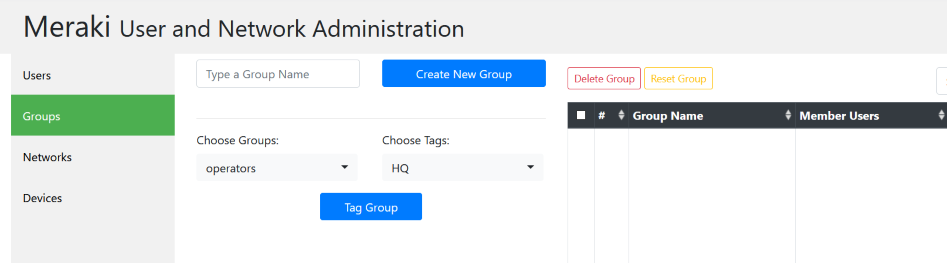
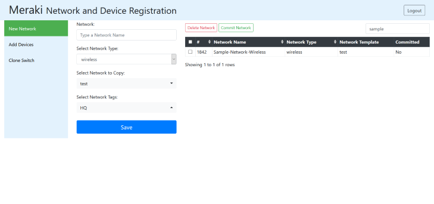
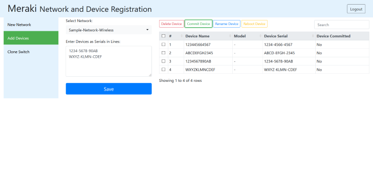
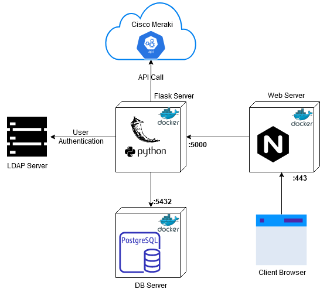
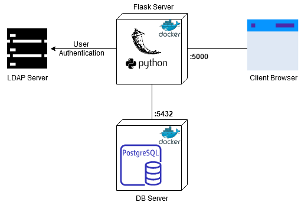

## GUI for Basic Operations on Meraki Networks
### Purpose
> The project benefits a full authorized api key on the server side; providing restricted
> and user authorized operations on the client side, such as adding new devices, renaming, rebooting, and
> pre-defined configurations etc. being developed as new needs come up in due course.

### Utilized Components:
- Python Flask, Postgresql on the server side.
- Bootstrap HTML, CSS and JS libraries and custom js functions on the server side.

### Functions:
- Admin panel for authorizing users against networks and tags.



- Adding new networks copying from existing templates and networks with tags.
- Committing from server db to meraki cloud.
- Prevention of deleting anything if committed to Meraki.



- Adding devices to existing networks.
- Rebooting or renaming any device with time restriction on code.
- Copying switch config from existing one to a new one.




## Container Deployment:
### 1. Production Environment
> Before continue beginning; ensure that pgsql_data directory and
>a database called meraki_operator is created inside it. This prerequisite can be met by 
>following the instructions under _2. Development Environment->Database_.



#### Steps to Deploy:

**1.** Clone the git-repo to your local directory.
```
$ git clone https://github.com/omertb/meraki-opui.git
```

**2. Nginx Config:**

a) Create a directory named _public_ and include your customized _500.html_ file in it.
You can copy the one included in repo. 

b) Create a directory named _ssl_ and include your subdomain certificates in it.

c) Copy the nginx.conf file into your local directory and change the related lines
(ssl and subdomain) appropriately in the config file.

**3.** Copy the files _Dockerfile_ and _docker-compose.yml_ to current directory.
```
$ cp meraki-opui/Dockerfile .
$ cp meraki-opui/docker-compose.yml .
```

**4.** Check if your current tree looks like below. If not, review previous steps:
```
.
├── meraki-opui
├── pgsql_data
├── public
├── ssl
├── docker-compose.dev.yml
├── docker-compose.yml
├── Dockerfile
└── nginx.conf

```

**5.** Start the containers on your host server. (Be sure that ports 80 and 443 are not occupied by another process)
```
$ docker-compose up -d
Starting meranet_my-postgres_1 ... done
Starting meranet_my-flask-project_1 ... done
Starting meranet_opui-nginx_1       ... done
$
$ docker-compose ps
           Name                         Command               State                    Ports
--------------------------------------------------------------------------------------------------------------
meranet_my-flask-project_1   gunicorn -w 3 -b 0.0.0.0:5 ...   Up      0.0.0.0:32782->5000/tcp
meranet_my-postgres_1        docker-entrypoint.sh postgres    Up      0.0.0.0:32781->5432/tcp
meranet_opui-nginx_1         /docker-entrypoint.sh ngin ...   Up      0.0.0.0:443->443/tcp, 0.0.0.0:80->80/tcp

```

> Containers are configured to be restarted in _docker-compose.yml_ file even if the host server is rebooted

### 2. Development Environment
>Below instructions might seem verbose; but it's just command line equivalent
of instructions in _Production Environment_ and it doesn't include nginx server.


#### Database:
```
$ pwd
/home/user

$ mkdir pgsql_data

$ docker run -d -p 5432:5432 --rm --name opui-postgres -v /home/user/pgsql_data:/var/lib/postgresql/data -e POSTGRES_PASSWORD=mysecretpassword postgres
$ docker exec -ti opui-postgres psql -U postgres

psql (12.3 (Debian 12.3-1.pgdg100+1))
Type "help" for help.

postgres=# CREATE DATABASE meraki_operator;
CREATE DATABASE

postgres=# exit
```

#### Flask Server:
```
$ git clone https://github.com/omertb/meraki-opui.git
$ docker run -ti --name my-flask-project -v /home/user/meraki-opui:/project python bash

## python-ldap requirements installation on debian:
root@689d54ef82ad:/project# apt-get install -y build-essential python3-dev libldap2-dev libsasl2-dev ldap-utils tox lcov valgrind
##
root@689d54ef82ad:/# cd project
root@689d54ef82ad:/project# pip install -r requirements.txt
root@689d54ef82ad:/project# exit

## Save your container as image not to lose your pip libraries:

$ docker commit my-flask-project my-flask-project
```

> Delete the container and run saved image with required environmental variables (replace the variables):
>
> docker run -ti --name my-flask-project --rm -p 5000:5000 --link opui-postgres -v /home/user/meraki-opui:/project -e PASSWDSALT=**your_pass_salt_for_bcrypt** -e FSECRETKEY=**your_random_flask_secret_key** -e PGCRED=postgres:**your_pg_pass** -e APIKEY=**your_meraki_api_key** -e USERDNSDOMAIN=**your_ldap_server_fqdn** my-flask-project python /project/run.py 0.0.0.0
>

```
$ docker rm my-flask-project

$ docker run -ti -d --name my-flask-project --rm -p 5000:5000 --link opui-postgres -v /home/user/meraki-opui:/project -e PASSWDSALT=your_pass_salt_for_bcrypt -e FSECRETKEY=your_random_flask_secret_key -e PGCRED=postgres:your_pg_pass -e APIKEY=your_meraki_api_key -e USERDNSDOMAIN=your_ldap_server_fqdn my-flask-project python /project/run.py 0.0.0.0

## let's create first tables
$ docker exec -ti my-flask-project bash
root@689d54ef82ad:/# cd project
root@689d54ef82ad:/project# python db_create.py

## Ready !! # first user who logs in is going to be admin

```
